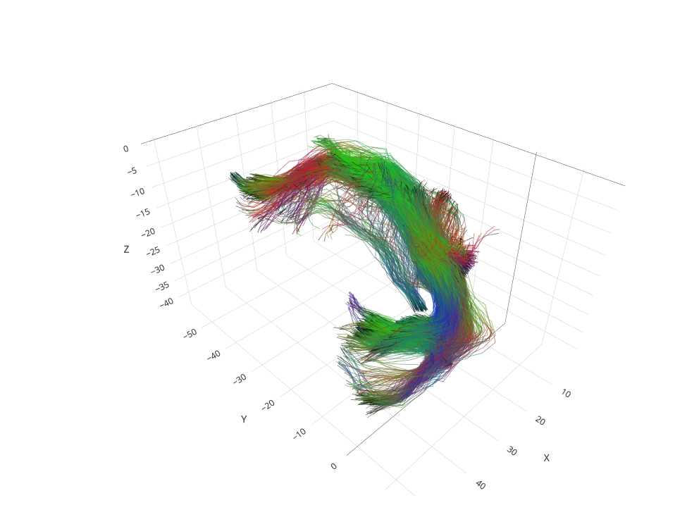

<!-- README.md is generated from README.Rmd. Please edit that file -->

```{r, include = FALSE}
knitr::opts_chunk$set(
  collapse = TRUE,
  comment = "",
  fig.path = "man/figures/README-",
  out.width = "100%"
)
```

# `rtists`

<!-- badges: start -->

[](https://github.com/astamm/rtists/actions)
[](https://github.com/astamm/rtists/actions)
[](https://app.codecov.io/gh/astamm/rtists?branch=master)
[](https://github.com/astamm/rtists/actions)
[](https://CRAN.R-project.org/package=rtists)

<!-- badges: end -->

The goal of `rtists` is to provide visualization tools for tissue
integrity superimposed on tractography streamlines.

## Installation

You can install the development version of `rtists` from
[GitHub](https://github.com/) with:

``` r
# install.packages("devtools")
devtools::install_github("astamm/rtists")
```

## Example

The following code generates a basic 3D visualisation of the left
uncinate fasciculus:

```{r example}
library(rtists)
library(future)
plan(multisession)
out <- autoplotly::autoplotly(uf_left)
plan(sequential)
```

```{r include=FALSE}
html_path <- knitr::fig_path("html")
png_path <- knitr::fig_path("png")
htmlwidgets::saveWidget(
  out, 
  file = html_path, 
  selfcontained = FALSE, 
  libdir = "lib"
)
webshot2::webshot(url = html_path, file = png_path)
```

[](https://astamm.github.io/rtists/articles/rtists.html)
